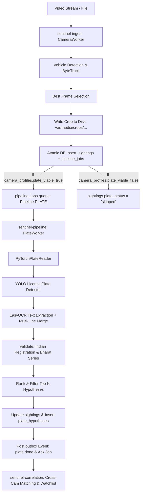

# Automated Number Plate Recognition (ANPR) Pipeline Documentation

## 1. Overview & Architecture

The **Sentinel ANPR Subsystem** is an integrated high-performance license plate localization, recognition, and correlation engine engineered for large-scale municipal CCTV camera networks (such as the Gujarat Police surveillance infrastructure).

### Key Architectural Tenets
1. **Survey Gating (`plate_viable`)**:
   - In urban CCTV environments, license plates are often unreadable on high-mounted or wide-angle cameras.
   - Sentinel gates ANPR execution based on the camera's surveyed capability (`camera_profiles.plate_viable`).
   - Cameras not marked as `plate_viable` immediately transition their plate status to `'skipped'`, preventing pipeline queues from backing up.
2. **Multi-Hypothesis Retention (`plate_hypotheses`)**:
   - Real-world OCR under varying illumination, angles, and speeds frequently confuses similar glyphs (e.g., `0` vs `D`/`O`, `8` vs `B`, `5` vs `S`, `1` vs `I`, `2` vs `Z`).
   - Rather than keeping only the top-1 guess as a monolithic string, Sentinel captures the top-$k$ reads ($k=3$) and persists them as individual indexable rows in `plate_hypotheses`.
3. **Confusion-Weighted Downstream Correlation**:
   - Cross-camera matching and watchlist alerting perform confusion-weighted edit distance matching over `plate_hypotheses`, indexed via PostgreSQL trigram GIN indexes (`plate_hypotheses_trgm_idx`).

---

## 2. Component Structure & File Map

| File Path | Role | Key Components |
|---|---|---|
| `packages/sentinel-pipelines/src/sentinel/pipelines/models/anpr.py` | Model Loading, Inference & Frame Annotation | `PyTorchPlateReader`, `StubPlateReader`, `PlateRead`, `validate()`, `load_plate_reader()`, `process_frame()`, `process_anpr_frame()` |
| `packages/sentinel-pipelines/src/sentinel/pipelines/plate.py` | Asynchronous Queue Worker | `PlateWorker` (derives from `PipelineWorker`), DB status updates & transactions |
| `packages/sentinel-ingest/src/sentinel/ingest/worker.py` | Ingest Worker & Best-Frame Selector | `CameraWorker`, ByteTrack integration, vehicle crop dispatch |
| `packages/sentinel-ingest/src/sentinel/ingest/writer.py` | Atomic Ingestion & Storage | `write_sighting()`, `write_crop()`, `archive_frame()`, `Gating` |
| `packages/sentinel-correlation/src/sentinel/correlation/plates.py` | Fuzzy Plate Matching | `similarity()`, `matches()`, `normalise()`, `trigram_prefilter()`, `CONFUSIONS` |
| `packages/sentinel-correlation/src/sentinel/correlation/candidates.py` | Plate Candidate Queries | `by_plate()`, cross-camera candidate retrieval |
| `packages/sentinel-core/src/sentinel/core/media.py` | Deterministic Media Storage Paths | `crop_path()`, `frame_path()`, `evidence_path()`, `relative()`, `absolute()` |
| `packages/sentinel-api/src/sentinel/api/routers/evidence.py` | Evidence & Sighting Query API | Returns `sightings`, `plate_hypotheses`, and media refs |

---

## 3. End-to-End Pipeline Execution Flow



### Detailed Pipeline Steps

1. **Detection & Best Frame Selection (`sentinel-ingest`)**:
   - The vehicle is tracked across frames using ByteTrack.
   - When the track closes or reaches peak confidence, `BestFrameSelector` selects the optimal bounding box.
   - The cropped vehicle image is stored on disk via `write_crop()` under:
     `var/media/crops/{camera_id}/{YYYY-MM-DD}/{HH}/{read_id}.jpg`
   - An entry is inserted into `sightings` referencing `crop_ref`.

2. **Job Claiming & Concurrency (`PlateWorker`)**:
   - `PlateWorker` claims pending jobs from `pipeline_jobs` using PostgreSQL `FOR UPDATE SKIP LOCKED`.
   - The crop image is loaded from disk using `media.absolute(job.crop_ref)`.

3. **Plate Localization (`PyTorchPlateReader`)**:
   - The vehicle crop is passed to the YOLO license plate detector (`license-plate-finetune-v1m.pt`).
   - Predicted bounding boxes for the plate are constrained to the crop boundaries.

4. **Text Extraction & Multi-Line Handling**:
   - EasyOCR reads the plate cutout.
   - In India, many plates are 2-line (e.g., `GJ01` on row 1, `AB1234` on row 2).
   - The OCR reader joins multi-box tokens in spatial reading order (top-to-bottom, left-to-right) as well as evaluating single lines.

5. **Format Validation & Raw OCR Output Control (`ENABLE_VALIDATION`)**:
   - The module provides a global toggle in capitals: `ENABLE_VALIDATION: bool = True` (in `sentinel.pipelines.models.anpr`).
   - **When `ENABLE_VALIDATION = True` (Default)**:
     - Characters are sanitized to uppercase alphanumeric (`[^A-Z0-9]`).
     - Validated against Indian registration formats:
       - **Modern**: `^[A-Z]{2}\d{1,2}[A-Z]{1,3}\d{4}$` (e.g., `GJ01AB1234`, `DL03CAA1234`)
       - **Short/Legacy**: `^[A-Z]{2}\d{1,2}[A-Z]{1,2}\d{1,4}$` (e.g., `GJ1A1234`, `DL1C9999`)
       - **Bharat Series**: `^\d{2}BH\d{4}[A-Z]{1,2}$` (e.g., `22BH1234AA`)
     - Verifies against all 36 Indian State and Union Territory RTO codes (`GJ`, `MH`, `DL`, `KA`, `TN`, `UP`, `RJ`, `JK`, `LA`, etc.).
   - **When `ENABLE_VALIDATION = False`**:
     - Strict format validation is bypassed (`validate()` returns `True` for non-empty text).
     - Outputs raw OCR text directly without stripping non-alphanumeric symbols or forcing Indian registration regex matching, making it adaptable for custom plates, international vehicles, or debugging OCR reads.

6. **Database Persistence (`sightings` & `plate_hypotheses`)**:
   - The best hypothesis is saved into `sightings.plate_text` and `sightings.plate_conf`.
   - All top-$k$ hypotheses are inserted into `plate_hypotheses (read_id, rank, plate, confidence)`.
   - Transaction completes with `plate.done` posted to the `outbox` table, notifying downstream correlation workers.

---

## 4. Configuration & Global Toggles

### 4.1. `OCR_ENGINE` Switch (`OCREngine` Enum)
The system supports multiple OCR engines via the `OCREngine` enum. It is optimized for CPU execution on systems without discrete GPUs.

```python
class OCREngine(str, Enum):
    EASYOCR = "easyocr"
    TESSERACT = "tesseract"

#: Global variable in sentinel.pipelines.models.anpr
OCR_ENGINE: OCREngine = OCREngine.TESSERACT
```

* **Engines**:
  * `OCREngine.TESSERACT` (Default / Active): Fast, lightweight C++ OCR engine with native AVX2/AVX512/SSE CPU vectorization, ideal for CPU-only environments. Includes adaptive/Otsu binarization and CLAHE contrast enhancement for license plate recognition.
  * `OCREngine.EASYOCR`: PyTorch CRAFT + ResNet deep learning OCR reader.
* **Usage**:
  ```python
  from sentinel.pipelines.models import anpr

  # Switch active engine globally
  anpr.OCR_ENGINE = anpr.OCREngine.TESSERACT

  # Or instantiate a reader with a specific engine
  reader = anpr.load_plate_reader(ocr_engine=anpr.OCREngine.TESSERACT)
  ```

### 4.2. `ENABLE_VALIDATION` (Global Variable)
Located in `packages/sentinel-pipelines/src/sentinel/pipelines/models/anpr.py`:
```python
ENABLE_VALIDATION: bool = True  # Set to False to disable regex/state checks and emit raw OCR text
```
* **Usage**:
  ```python
  from sentinel.pipelines.models import anpr

  # Turn off validation to capture raw OCR output
  anpr.ENABLE_VALIDATION = False
  ```

### 4.1. `PlateRead` Data Structure
```python
@dataclass
class PlateRead:
    text: str                               # Sanitized plate string (e.g. 'GJ01AB1234')
    confidence: float                       # Combined score (lp_score * ocr_prob)
    rank: int                               # Rank order (1 = highest confidence)
    valid_format: bool                      # Passed Indian format validation
    bbox: tuple[int, int, int, int] | None  # Local (lx1, ly1, lx2, ly2) bounding box
```

### 4.2. Full Frame Return Object (`process_frame`)
```json
[
  {
    "vehicle_bbox": [120, 240, 580, 610],
    "crop_bbox": [100, 220, 600, 630],
    "class": "car",
    "vehicle_conf": 0.9412,
    "plate_detected": true,
    "plate_bbox": [280, 520, 420, 565],
    "plate_text": "GJ01AB1234",
    "plate_confidence": 0.8924,
    "valid_format": true,
    "hypotheses": [
      { "rank": 1, "plate": "GJ01AB1234", "confidence": 0.8924, "valid_format": true },
      { "rank": 2, "plate": "GJ01DB1234", "confidence": 0.7139, "valid_format": true }
    ]
  }
]
```

### 4.3. Database Tables

#### `sightings` (ANPR Columns)
- `plate_text` (`text`): Best detected license plate string.
- `plate_conf` (`real`): Confidence score of the top reading.
- `plate_status` (`pipeline_status`): State of plate pipeline (`pending`, `done`, `skipped`, `failed`, `timeout`).

#### `plate_hypotheses`
```sql
CREATE TABLE plate_hypotheses (
  read_id     uuid NOT NULL REFERENCES sightings(read_id) ON DELETE CASCADE,
  rank        smallint NOT NULL CHECK (rank >= 1),
  plate       text NOT NULL,
  confidence  real NOT NULL,
  PRIMARY KEY (read_id, rank)
);
CREATE INDEX plate_hypotheses_trgm_idx ON plate_hypotheses
  USING gin (plate gin_trgm_ops);
```

---

## 5. Artifacts Storage & Retention Management

| Artifact Type | Storage Location Path | Reference in DB | Generation Trigger |
|---|---|---|---|
| **Vehicle Crop** | `var/media/crops/{camera_id}/{YYYY-MM-DD}/{HH}/{read_id}.jpg` | `sightings.crop_ref` | On best-frame track termination |
| **Archived Frame** | `var/media/frames/{camera_id}/{YYYY-MM-DD}/{HH}/{YYYYMMDDTHHMMSS}.jpg` | `frames.path` | 1 FPS sampled video archive |
| **Violation Evidence** | `var/media/evidence/{camera_id}/{YYYY-MM-DD}/{HH}/{key}.jpg` | `violations.evidence_ref` | On detected violation |
| **Annotated Frame** | Specified via `output_path` in `process_anpr_frame` | Operator / Export Tooling | Manual or Batch offline processing |

### Storage Characteristics
- **Deterministic Partitioning**: Partitioned by `{camera_id}/{YYYY-MM-DD}/{HH}` to ensure filesystem directories remain manageable even at 80,000+ camera scale.
- **Relocatable Media Root**: All database paths are stored relative to `settings.media_root` via `media.relative()`.
- **Automatic Directory Creation**: `media.crop_path` and `process_anpr_frame` automatically create nested parent directories prior to writing.

---

## 6. Testing, Quality Assurance & Verification

The ANPR test suite is verified via `pytest`:

### Test Coverage
- `tests/test_anpr_pipeline.py`:
  - Unit tests for standard, legacy, short, and Bharat series (`BH`) format validation.
  - Verification of invalid plate rejection and OCR garbage filtering.
  - Deterministic `StubPlateReader` validation.
  - End-to-end `process_anpr_frame` visual annotation and artifact saving verification.
  - Asynchronous `PlateWorker` transactional processing with mock database connections.
- `tests/test_plates.py`:
  - Confusion-weighted Levenshtein similarity testing (`0`<->`D`, `8`<->`B`, `5`<->`S`, etc.).
  - Trigram prefilter validation for fast GIN index queries.
- `tests/test_models.py`:
  - Stub hit-rate and fallback testing.

### Running the Test Suite
```bash
# Set PYTHONPATH for workspace packages and run tests
$env:PYTHONPATH="packages/sentinel-core/src;packages/sentinel-registry/src;packages/sentinel-ingest/src;packages/sentinel-pipelines/src;packages/sentinel-correlation/src;packages/sentinel-api/src"
uv run pytest tests/test_anpr_pipeline.py tests/test_plates.py tests/test_models.py
```
